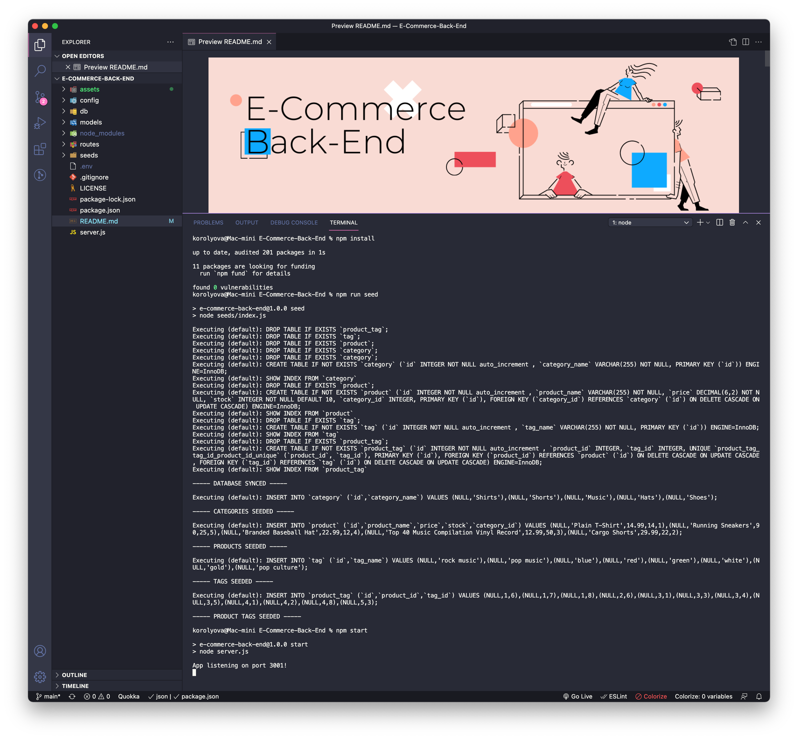
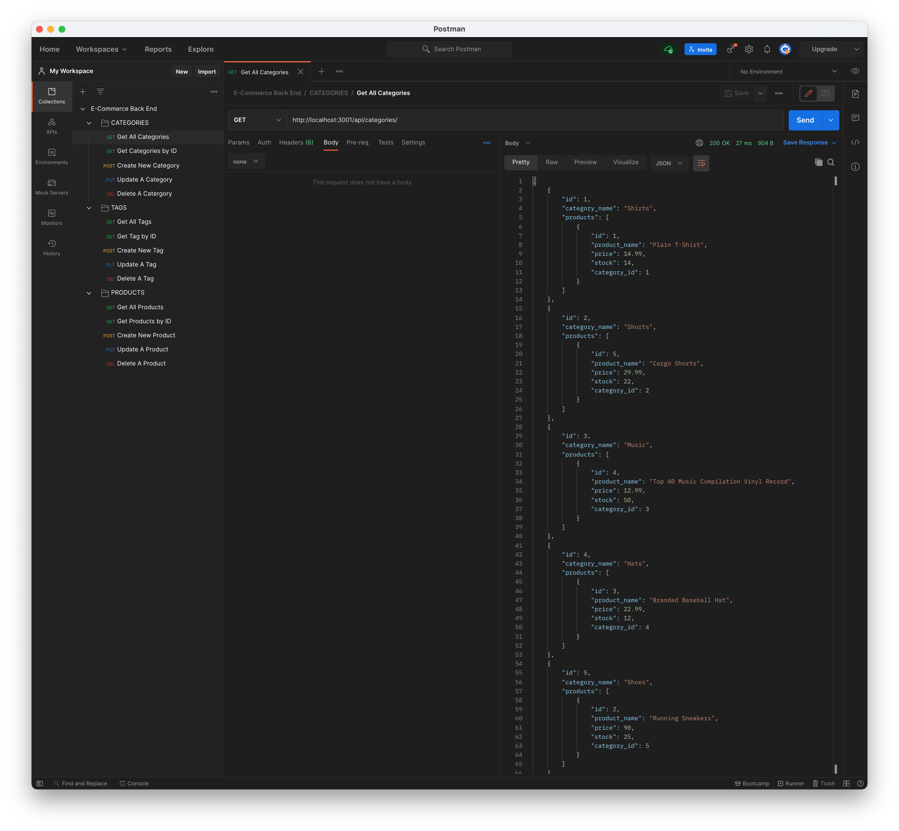

  
Table of Contents

  <ol>
    <li><a href="#description">Description</a></li>
    <li><a href="#features">Features</a></li>
    <li><a href="#technical-part">Technical Part</a>
        <ul>
            <li><a href="#demo">Demo</a></li>
            <li><a href="#installation">Installation</a></li>
            <li><a href="#usage">Usage</a></li>
            <li><a href="#contributing">Contributing</a></li>
        </ul>
    </li>
    <li><a href="#questions">Questions</a></li>
    <li><a href="#license">License</a></li>
    <li><a href="#notes">Notes</a></li>
  </ol>

## Description

This application is the back-end of an e-commerce site and will require connection to a front-end for public use.
This application utilizes Express.js API and Sequelize to interact with a MySQL database to create a back end for an e-commerce website.
This application creates a database using mySQL with models and associations.

## Features

- JavaScript
- Node.js
- Express.js
- MySQL
- Sequelize
- npm

## Technical Part

### _Demo_

The screenshots and videos below show this application previews:

- Installation [Demo](https://drive.google.com/file)

- Usage [Demo](https://drive.google.com/file)

### _Installation_

1. Download or clone repository.
2. [**Node.js**](https://nodejs.org/en/about/) and [**MySQL Workbench**](https://dev.mysql.com/doc/workbench/en/) are required to run the application.
3. Run `npm install` in the Terminal to install the required npm packages
4. In the root of the application, create `.env` file and enter the following details for your MySQL:

   `DB_NAME=ecommerce_db`

   `DB_USER=`**your username**

   `DB_PASSWORD=`**your password**

5. Open up MySQL shell and input:

   `source db/schema.sql`

6. Run the following in the Terminal to seed test data:

   `npm run seed`

### _Usage_

- To start using the application, input the following in your Terminal

  `npm start`

  or

  `node server.js`

- Open up [**Postman**](https://www.postman.com/) or [**Insomnia**](https://insomnia.rest/) to GET, POST, PUT and DELETE from different routes

- Or navigate to `http://localhost:3001/` in your browser

- Enjoy!

### _Contributing_

Pull requests are welcome. For major changes, please open an issue first to discuss what you would like to change, so I learn and understand it better.

Please make sure to update tests as appropriate, if applicable.

## Questions

- Checkout my [GitHub profile](https://github.com/KorolyovaLara)
- Any additional questions or feedback, feel free to [send an email](mailto:larakorolyova@gmail.com).

## License

Copyright (c) [Larysa Korolyova](https://www.linkedin.com/in/korolyova/). All rights reserved.

Licensed under the [MIT](https://github.com/KorolyovaLara/E-Commerce-Back-End/blob/main/LICENSE) license.

---

### Notes

Quote that recently inspired me:

> Happiness is not the absence of problems, it’s the ability to deal with them. -_Steve Maraboli_

---

© 2021 L Korolyova
